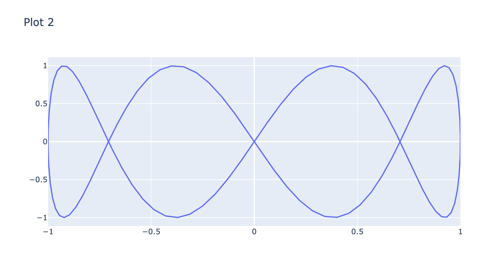

# tz_flask_20230308_graph
show graph on web

each time you reload the web, unique graph will be shown.

### How to place the files.
* app.py
* templates/index.html

### How to run
* export FLASK_APP=app.py
* export FLASK_ENV=development
* flask run

